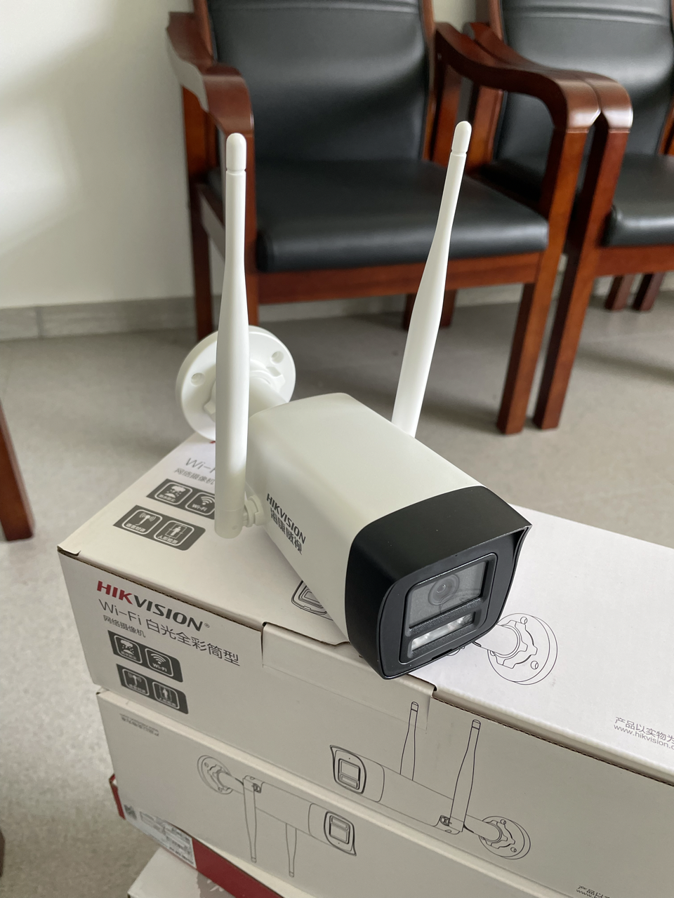
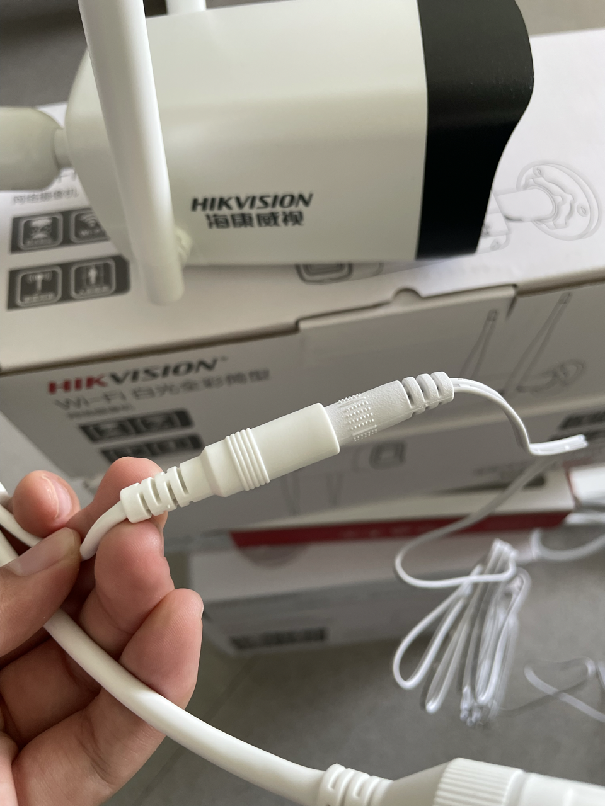
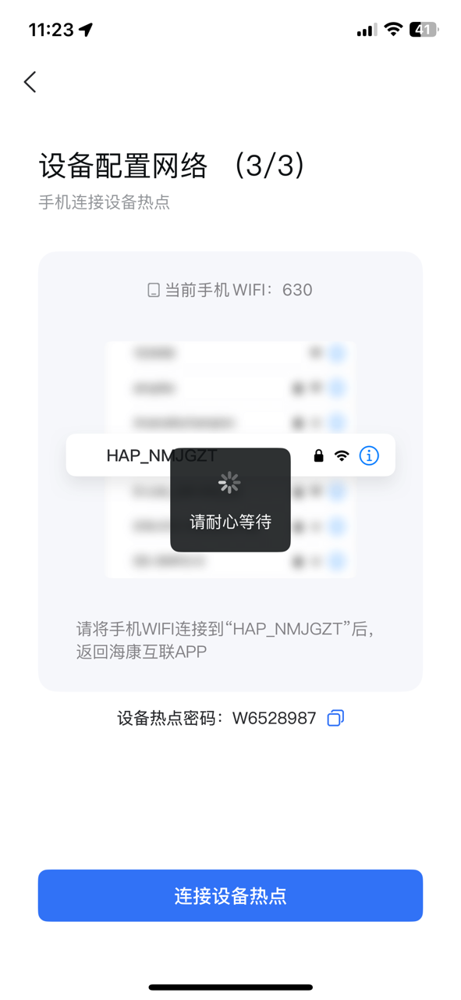
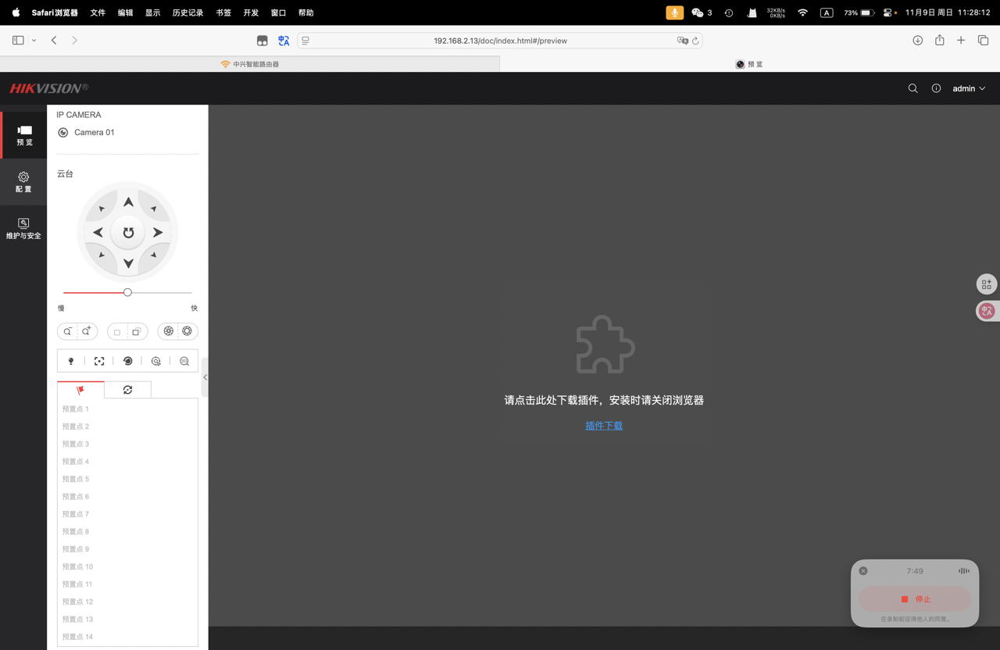
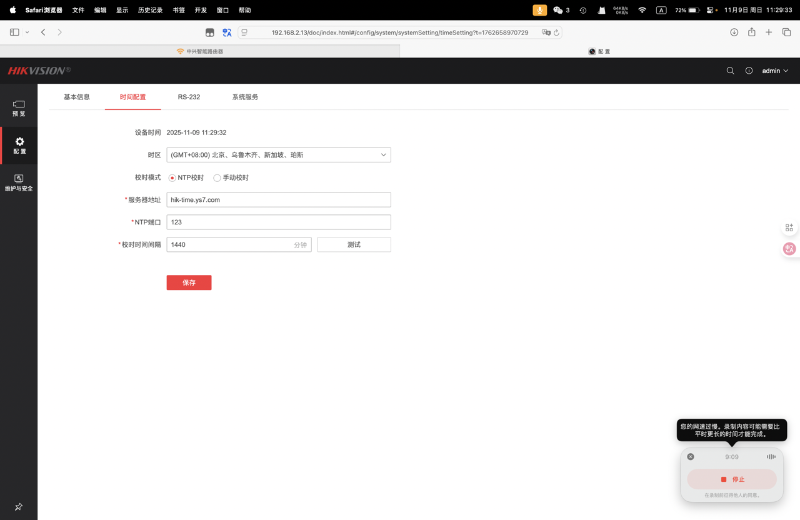

# 📸 海康网络摄像头安装与配置指南

**文档目的**
本指南旨在帮助新用户快速完成摄像头的安装、联网配置及系统设置。

------------------------------------------------------------------------

## 一、开箱与部件确认

打开包装盒后，请核对以下内容是否齐全：

-   ✅ 摄像头本体
-   ✅ 安装孔位定位贴纸
-   ✅ 电源适配器
-   ✅ 安装螺丝及说明书

------------------------------------------------------------------------

## 二、安装准备与布线

将摄像头从包装中取出，准备安装位置。
安装时请注意以下事项：

-   保持摄像头无遮挡，距离电源插座合适；
-   若墙面安装，请使用定位贴纸对准孔位钻孔；
-   固定好支架后，将摄像头接入电源。

> 提示：摄像头一般引出两根线，一根为网线，一根为电源线。

------------------------------------------------------------------------

## 三、手机端连接与配置 Wi-Fi

1.  打开手机应用商店，下载并安装 **海康互联**。
2.  打开并注册完成软件后，点击右上角的 **扫一扫**。
3.  扫描摄像头机身或者说明书首页上的二维码。

4.  扫描后系统右上角提示 "请配置Wi-Fi"。
5.  点击右上角 **仅配置Wi-Fi**，按提示输入您的 Wi-Fi 名称和密码。
6.  稍等片刻，手机提示"连接成功"。

------------------------------------------------------------------------

## 四、电脑端激活与

1.  在电脑端浏览器输入摄像头的 **IP地址**（可在路由器设备管理页查看）。
2.  首次访问将提示激活界面，请设置登录密码。

> **注：此处账户密码将在电脑推流时用到**

3.  登录后进入后台主界面，左侧可见三个模块：
    -   预览
    -   配置
    -   维护与安全

> 如果仅用于本地访问，可保持默认设置。

------------------------------------------------------------------------

## 五、系统时间与名称设置

1.  进入左侧菜单 **系统 → 系统设置 → 时间配置**。
2.  启用 **NTP 自动校时**，以保持时间同步。
3.  在 **基本信息** 中可修改设备名称，便于识别。
>根据需要可以选择同步设备本地时间

## done
